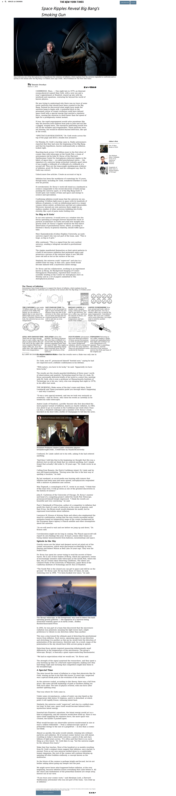

# Project 1: Positioning and Floating Elements

> Clone of https://www.nytimes.com/2014/03/18/science/space/detection-of-waves-in-space-buttresses-landmark-theory-of-big-bang.html?_r=0 

Additional description about the project and its features.

## Built With

- HTML5
- CSS3#

## Live Demo

[Live Demo Link](https://oxenprogrammer.github.io/new-york-times-clone/)

## Getting Started

To get a local copy up and running follow these simple example steps.

### Prerequisites
N/A

### Setup
Clone or Download the project from github.com
### Install
No installation required, simply right click on the index.html file and run it on your favorite browser.

### Deployment
Deploy on gh pages for testing purposes

## Authors

👤 **Author1**

- GitHub: [@githubhandle](https://github.com/oxenprogrammer)
- Twitter: [@twitterhandle](https://twitter.com/ox_emmy)
- LinkedIn: [LinkedIn](https://www.linkedin.com/in/emanuel-okello-1217b4b3/)

👤 **Author2**

- GitHub: [@githubhandle](https://github.com/diamond-nicholas)
- Twitter: [@twitterhandle](https://twitter.com/diamondnich)
- LinkedIn: [LinkedIn](https://www.linkedin.com/in/diamond-nicholas/)

## 🤝 Contributing

Contributions, issues, and feature requests are welcome!

Feel free to check the [issues page](https://github.com/oxenprogrammer/new-york-times-clone/projects/1#card-50109567).

## Show your support

Give a ⭐️ if you like this project!

## Acknowledgments

- https://www.theodinproject.com/
- https://www.nytimes.com/2014/03/18/science/space/detection-of-waves-in-space-buttresses-landmark-theory-of-big-bang.html?_r=0

## 📝 License

This project is [MIT](lic.url) licensed.